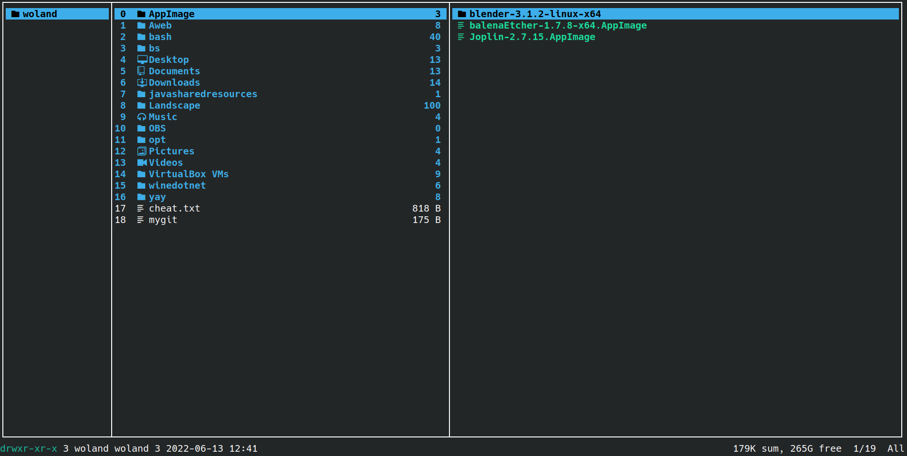
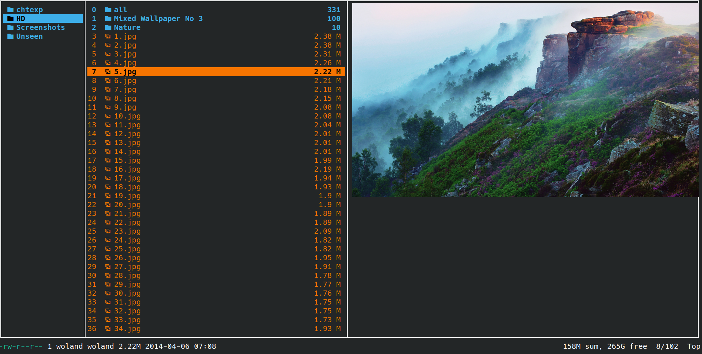

# ranger

  <ul>
    <li>تنظیمات رنجر من </li>
<li>ارتباط فایل‌ها با برنامه‌ها </li>
<li>کادر زیبا</li>
<li>آیکون</li>
<li>و چند چیز دیگر</li>
  

<h3> روش استفاده </h3>

  تمام فایل‌ها و پوشه پلاگین را در مسیز زیر قرار دهید 
   ~/.config/ranger
   
  
محتویات پوشه فونت ها را در فهرست فونت های خود کپی کنید معمولاً در: 
  /usr/share/fonts  
  یا  
  ~/.local/share/fonts  
   اگر آیکون می خواهید از فونت های nerd ارائه شده؛ در ترمینال انتخابی خود استفاده کنید. شما همچنین می توانید از هر فونت دیگری که آیکون و گلیف را پشتیبانی می‌کند استفاده کنید.من هک را ترجیح می‌دهم.
   برای پیش نمایش تصویر در ترمینال باید 'ueberzug' یا 'w3m' را نصب کرده باشید. ممکن است مجبور شوید scope.sh را به صورت دستی به عنوان یک فایل اجرایی تنظیم کنید!
   برای انجام این کار: chmod +x scope.sh
   من از ueberzug  برای نمایش تصاویر در ترمینال در پیکربندی خود استفاده کرده ام.
   این یک تنظیم مینیمال و عاقلانه است. لذت ببرید.  
   

